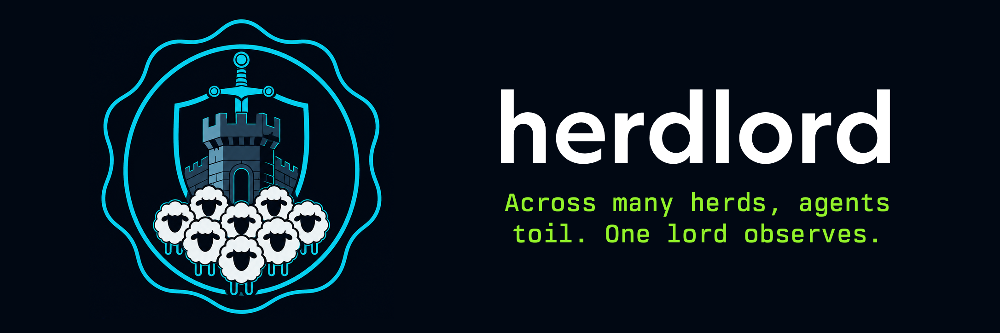
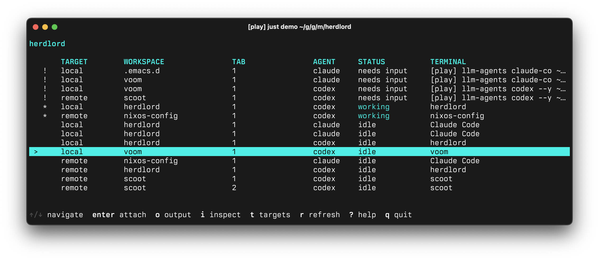

# Herdlord



---

Herdlord is a TUI and CLI for monitoring agents across local and remote
[Herdr](https://herdr.dev) sessions. From a single dashboard, you can see every
agent, find the ones that need attention, inspect output, and attach to any
session.

> [!NOTE]
> Herdr is a terminal multiplexer for coding agents. Herdlord is a
> _Herdr multiplexer_.



## Installation

### Install a release build

Download the archive for your platform from the
[GitHub releases page](https://github.com/mjrusso/herdlord/releases), then
verify it against `checksums.txt` before extracting it:

```sh
archive=herdlord_linux_x64.tar.gz
grep " $archive$" checksums.txt | sha256sum -c -
tar -xzf "$archive"
mkdir -p ~/.local/bin
install -m 0755 herdlord ~/.local/bin/herdlord
```

Choose the archive name that matches your OS and architecture. On macOS, use
`shasum -a 256 -c -` instead of `sha256sum -c -`. Release binaries are not
notarized by Apple. If Gatekeeper quarantines the downloaded binary, clear the
quarantine attribute after verifying its checksum:

```sh
xattr -d com.apple.quarantine ./herdlord
```

### Install with Nix

```sh
nix profile install github:mjrusso/herdlord
```

Or run Herdlord without installing it:

```sh
nix run github:mjrusso/herdlord
```

### Install with Go

With Go 1.26 or newer:

```sh
go install github.com/mjrusso/herdlord/cmd/herdlord@latest
```

### Build from source

See [CONTRIBUTING.md](CONTRIBUTING.md) for source builds and development setup.

## Getting started

In each environment you want to monitor, install a
[supported version](#requirements-and-compatibility) of
[Herdr](https://herdr.dev) and
[start a Herdr session](https://herdr.dev/docs/quick-start/).

With Herdr running in one terminal, start Herdlord in another:

```sh
herdlord
```

Press `t` to open target management, then press `a` to add a target. Enter
`local` as the name, leave both prefix fields empty, and press `Enter`. After
Herdlord validates the target, press `q` to return to the dashboard.

Or add the local target from the CLI:

```sh
herdlord targets add local
```

Agents from the local Herdr session now appear in the dashboard. Select an
agent and press `Enter` twice to confirm and attach. To return to Herdlord,
press `Ctrl-b`, then `q`.

To add a remote session over SSH, first verify that both sessions are reachable
from the terminal where you run Herdlord:

```sh
herdr status
ssh workbox -- herdr status
```

The second command checks the session on an example SSH host named `workbox`.
Once the remote command succeeds, press `t` and then `a` in Herdlord. Enter
these values:

| Field          | Value               |
|----------------|---------------------|
| Name           | `remote`            |
| Command prefix | `ssh workbox --`    |
| Attach prefix  | `ssh -t workbox --` |

Press `Enter` to validate and save the target, then press `q` to return to the
dashboard.

Or add the remote target from the CLI:

```sh
herdlord targets add remote \
  --prefix 'ssh workbox --' \
  --attach-prefix 'ssh -t workbox --'
```

Agents from both sessions appear together with their Herdr workspace and tab
labels. Agents that need attention appear first.

## Dashboard

### Controls

Run `herdlord`, then use these keys:

| Keys                    | Action                                                         |
|-------------------------|----------------------------------------------------------------|
| `↑`, `k`, `C-p`         | Select the previous row.                                       |
| `↓`, `j`, `C-n`         | Select the next row.                                           |
| `Page Up`, `b`, `M-v`   | Move one page up.                                              |
| `Page Down`, `f`, `C-v` | Move one page down.                                            |
| `C-u`, `C-d`            | Move half a page up or down.                                   |
| `Home`, `g`             | Select the first row.                                          |
| `End`, `G`              | Select the last row.                                           |
| `t`                     | Open target management.                                        |
| `Enter`                 | Review and confirm attachment to the selected agent.           |
| `i`                     | Toggle the selected agent's inspector.                         |
| `o`                     | Expand and scroll the selected agent's recent terminal output. |
| `r`                     | Refresh all active targets.                                    |
| `?`                     | Show every key binding.                                        |
| `q`                     | Quit from the dashboard.                                       |

Press `Esc` to close a panel or cancel a form. `Ctrl-C` quits from every
screen.

### Agent inspection and attachment

Select an agent and press `i` to open its inspector. The inspector shows its
workspace, tab, pane, working directory, terminal title, and recent output.
Press `o` to open a scrollable output view. Use the arrow keys, Page Up,
Page Down, Home, or End to scroll, and press `Esc` to return.

Press `Enter` to review an attachment. Herdlord shows the key sequence for
returning to the dashboard. Press `Enter` again to attach. To return, press
`Ctrl-b`, then `q`. Herdlord uses this sequence even if the full Herdr TUI has
a custom prefix.

### Agent status

Agent status comes directly from Herdr. Herdlord uses Herdr's `done`, `working`,
`idle`, and `unknown` labels, but displays `blocked` as `needs input`.
Inspecting an agent or reading its output does not acknowledge or change its
state.

The `>` marker identifies the selected row without relying on terminal color.
An `!` marks a blocked agent, `●` marks a done agent, `*` marks a working
agent, and `◇` marks a target-status row rather than an attachable agent.

### Target management

Press `t` to open target management. Use `a` to add, `e` to edit, `d` to
delete, or `space` to pause or resume the selected target. Pausing stops polling
without deleting the target. Press `q` or `Esc` to return to the dashboard.

Each target has a unique name and a command prefix. Leave the command prefix
empty for a local target. The optional attach prefix defaults to the command
prefix. Interactive transports may need extra flags to allocate a TTY. For SSH,
use `ssh -t`.

Use `Tab` or `Shift-Tab` to move between fields. Press `Enter` to validate and
save the target, or press `Esc` to cancel.

The dashboard automatically reloads target changes made through the CLI.

### Target health

The dashboard lists target health separately from agent status. Each row shows
the target's polling state, last successful refresh, and latest error. A target
appears as `checking` until Herdlord receives its first response.

Target health describes Herdlord's connection to a Herdr session. It does not
change the status of agents in that session.

## Command line

Running `herdlord` without a command opens the dashboard. The same configured
targets are also available to non-interactive commands. See the
[command reference](docs/commands/herdlord.md) for all commands and flags.

List agents across active targets:

```sh
herdlord list
herdlord list --target remote
herdlord list --include-paused
```

Inspect target reachability and protocol compatibility without fetching agent
snapshots:

```sh
herdlord status
herdlord status remote
```

Status output includes the last successful refresh.

Read recent plain-text output using a `pane_id` returned by `list`:

```sh
herdlord read remote w1:p1 --lines 50
```

Manage persisted target definitions:

```sh
herdlord targets list
herdlord targets show remote
herdlord targets update remote --prefix 'ssh new-workbox --'
herdlord targets pause remote
herdlord targets resume remote
herdlord targets rm remote
```

The [getting-started guide](#getting-started) shows how to add local and SSH
targets. Omit `--prefix` when adding a target that points to the local machine.
The attach prefix defaults to the normal prefix. Set `--attach-prefix ''`
during an update to restore that default.

Target validation reports connection and compatibility problems without
preventing the target from being saved.

Use `--output json` or `--format json` for scripts. Agent records include the
authoritative `workspace` and `tab` labels with their stable `workspace_id` and
`tab_id`. A failed target remains in the JSON response alongside successful
targets.

Fleet commands return a non-zero status only when every requested target fails.

## Targets and transports

Each target has a user-defined name and an optional command prefix. The prefix
lets Herdlord work locally or through any transport that can run Herdr in the
target environment, such as SSH and [Voom](https://github.com/mjrusso/voom).

| Target name | Transport | Command prefix     |
|-------------|-----------|--------------------|
| `remote`    | SSH       | `ssh workbox --`   |
| `dev-vm`    | Voom      | `voom ssh play --` |
| `local`     | Local     | empty              |

Herdlord sits in front of Herdr rather than replacing it:

```text
Herdlord -> target command -> Herdr session -> agents
```

For monitoring, Herdlord runs non-interactive Herdr status, snapshot, and
output commands through each target and combines the responses. For attachment,
Herdlord gives the terminal to Herdr's interactive client through the target's
attach prefix. Herdr owns the agent lifecycle and remains the source of agent
state. Herdlord owns target configuration, polling health, and the combined
view.

A target prefix must run commands in an environment where Herdr is installed
and its server is running. Interactive attachment can require a different
prefix with transport-specific TTY flags, such as `ssh -t` or `kubectl exec
-it`.

### Prefix execution and security

Target prefixes use shell-like quoting to split the configured text into
arguments. Herdlord does not run the prefix through a local shell or expand
environment variables, command substitutions, or backticks. It appends the
Herdr command and arguments to that prefix and executes the resulting argument
list directly. The configured transport may invoke a shell in the target
environment. For example, a monitoring call through `ssh workbox --` is shaped
like `ssh workbox -- env -u HERDR_SOCKET_PATH -u HERDR_CLIENT_SOCKET_PATH
/path/to/herdr ...`.

The transport process inherits the current user's environment and uses that
user's transport configuration and credentials. Only configure prefixes you
trust.

## Requirements and compatibility

Herdlord supports Linux and macOS on AMD64 and ARM64. It distinguishes tested
compatibility from best-effort forward compatibility:

|    Protocol | Known Herdr version                                            | Behavior                        |
|------------:|----------------------------------------------------------------|---------------------------------|
| 18 or older | —                                                              | Rejected as `skewed`            |
|          19 | [0.8.0](https://github.com/herdrdev/herdr/releases/tag/v0.8.0) | Supported                       |
|          20 | [0.8.2](https://github.com/herdrdev/herdr/releases/tag/v0.8.2) | Supported                       |
| 21 or newer | —                                                              | Attempted as `newer` (untested) |

Targets below protocol 19 are rejected as `skewed`. When a target reports a
newer, untested protocol, Herdlord marks it as `newer` but still attempts to
fetch agents, read output, and attach. This preserves forward compatibility
without presenting an untested combination as supported. Herdlord does not
install Herdr or transport programs such as SSH or Voom.

Forward compatibility is best effort. Additive protocol changes should continue
to work because Herdlord ignores snapshot fields it does not use. If a newer
Herdr release changes a command or a field that Herdlord relies on, that
operation may fail and the reported target error will identify the failing
command or response.

## Agent skill

Herdlord ships version-matched instructions that teach coding agents how to
inspect configured targets and read agent output:

```sh
herdlord skill
herdlord --skill
herdlord skill --output json
```

Installation is optional; an agent can run `herdlord skill` when it needs the
instructions. To install a copy in a conventional agent-skills directory:

```sh
mkdir -p ~/.agents/skills/herdlord
herdlord skill > ~/.agents/skills/herdlord/SKILL.md
chmod 0644 ~/.agents/skills/herdlord/SKILL.md
```

## Troubleshooting

Start with the target health and configuration commands:

```sh
herdlord status
herdlord status remote
herdlord targets show remote
```

- **`no herdr`**: Herdr was not found on the target.
- **`unreachable`**: The transport or Herdr command failed. Check the reported
  error and target prefix.
- **`skewed`**: The target's Herdr protocol is too old for this Herdlord build.
- **`newer`**: The target uses a newer, untested protocol. Herdlord continues
  when possible, but individual operations can fail.
- **`backing off`**: A target check failed, and automatic retries have slowed
  down. The accompanying error identifies the cause.
- **`timed out`**: A target command exceeded `--timeout`. Increase the timeout
  for a slow transport, or investigate the target.

If monitoring works but attachment fails, inspect the attach prefix. For SSH,
use `ssh -t` to allocate a TTY. Other transports may require equivalent
interactive or TTY flags. Update or remove a bad target with `herdlord targets
update` or `herdlord targets rm`.

Targets are stored in `$XDG_CONFIG_HOME/herdlord/targets.json`, or the platform
user configuration directory when `XDG_CONFIG_HOME` is unset. Removing this
file resets Herdlord's target configuration only; it does not stop Herdr or any
agent. Use `--config <path>` to test with a disposable configuration file.

## Development

Enter the Nix development shell and run the checks:

```sh
nix develop
just check
```

Build a local binary with:

```sh
just build
./bin/herdlord --version
```

See [CONTRIBUTING.md](CONTRIBUTING.md) for more details.

## License

Herdlord is released under the terms of the [MIT License](LICENSE).

Copyright (c) 2026, [Michael Russo](https://mjrusso.com).
